<link rel="stylesheet" href="{{ '/assets/css/custom.css' | relative_url }}">
<nav id="sidebar">
- [Introducción](#introducción)
- [Instalación](#instalación)
- [Configuración del entorno](#configuración-del-entorno)
- [Debug con OpenOCD](#debug-con-openocd)
- [Solución de errores](#solución-de-errores)
</nav>
# Windows
## Entorno de trabajo

Lo primero que vamos a hacer es setear nuestro entorno de trabajo básico.
1. Instalar [VSCode](https://code.visualstudio.com/download) 
2. Instalar la extensión *Cortex-Debug* 

## Utilidades necesarias
Se recomienda que antes de comenzar a instalar las utilidades, dirigirse a la sección de "Verificación antes de continuar" para evitar descargar archivos que ya tengamos instalados y funcionando perfectamente en nuestra computadora.

--- 
### Instalación OpenOCD
1. Descargar el archivo .7z de [OpenOCD]([Download OpenOCD for Windows](https://gnutoolchains.com/arm-eabi/openocd/))  (Descargar la última versión) (Para descomprimir .7z se debe instalar [7zip]([Download](https://www.7-zip.org/download.html)), .msi o .exe para sistemas de 64 bits).
2. Click derecho en archivo "openocd-2025####.7z" descargado, Mostrar más opciones -> 7z -> Extraer aqui.
3. Copiar y pegar la carpeta extraida en el disco C.
4. Cambiarle el nombre a la carpeta a simplemente "openocd" (Evidentemente se puede crear una subcarpeta en el disco C y alli meter esta, no hay problema con eso)
5. Entrar a la carpeta y en la carpeta "bin" copiar la ruta de acceso a la misma. Deberia quedar algo como "C:\openocd\bin".
6. Nos vamos al buscador de Windows y buscamos las palabras clave "Variables de entorno" y nos aparecerá algo asi.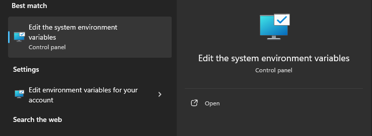 Luego clickeamos en variables de entorno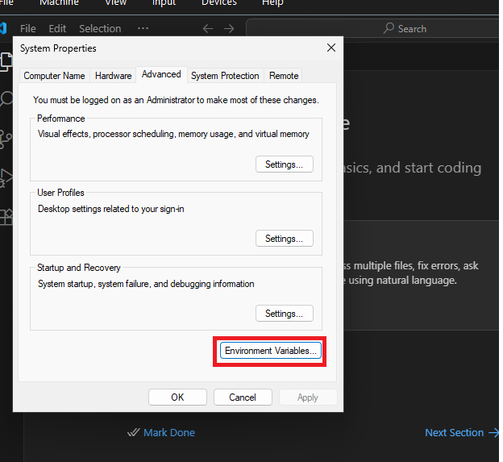 Luego clickeamos en Path de Variables del Sistema -> Editar -> Nueva/o -> Pegamos la ruta de acceso que copiamos previamente (openocd/bin).  Si da algun error, puede ser porque falten las doble comillas " al principio y al final de la ruta pegada.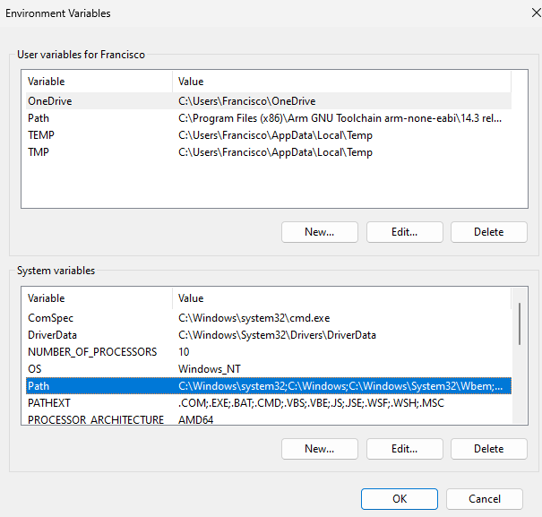
### Instalación del toolchain de GNU para CPU ARM

1. Descargar de la pagina oficial de ARM el ejecutable correspondiente a **AArch32 bare-metal target (arm-none-eabi) **[Descargar ARM GNU Toolchain]([Arm GNU Toolchain Downloads – Arm Developer](https://developer.arm.com/downloads/-/arm-gnu-toolchain-downloads))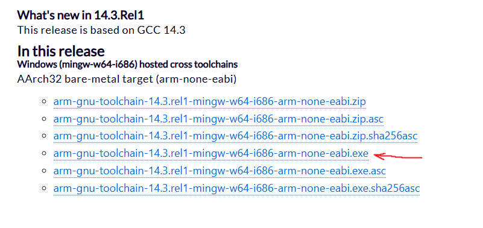
2.  Luego de instalarse, nos preguntará si deseamos añadirlo al Path, tildaremos esa opción.
3.  Si por algun motivo te olvidas de tildar la opcion, podes añadirlo al Path como hiciste con OpenOCD, deberia quedar algo como esto "C:\Program Files (x86)\Arm GNU Toolchain arm-none-eabi\14.3 rel1\bin"

--- 
Debe quedar claro que CMake y STM32CubeMX no son estrictamente necesarios para debuggear con el método que se muestra en la guía, ya que no importa de que manera se logra compilar el .elf, lo importante es tener acceso a él. 

### Instalación de CMake

Usaremos CMake para poder trabajar de forma cómoda en el entorno de VSCode, además de ser facil de configurar, es indispensable para compilar sin tantos problemas, ya que compilar codigo C en VSCode no siempre resulta sencillo. [Download CMake](https://cmake.org/download/) 
#### Windows
En la sección de "*Binary distributions*" descargamos la primera .msi, para no tener que compilar el codigo fuente nosotros. Al momento de instalar, tildamos la opcion de añadir CMake al PATH.
#### Linux
Probablemente ya este instalado, sino, descargar lo correspondiente desde la misma pagina 
	Nota: No funcionará el instalador .msi en Linux

### Instalación de Ninja
[Releases · ninja-build/ninja](https://github.com/ninja-build/ninja/releases) Simplemente descargamos el binario precompilado (el .exe), ahora copiamos la carpeta que lo contiene en la carpeta de "Toolchain" que habiamos usado para que quede ordenado el arm-gnu-toolchain, lo importante es sacarlo de Descargas para que no lo borremos sin querer.

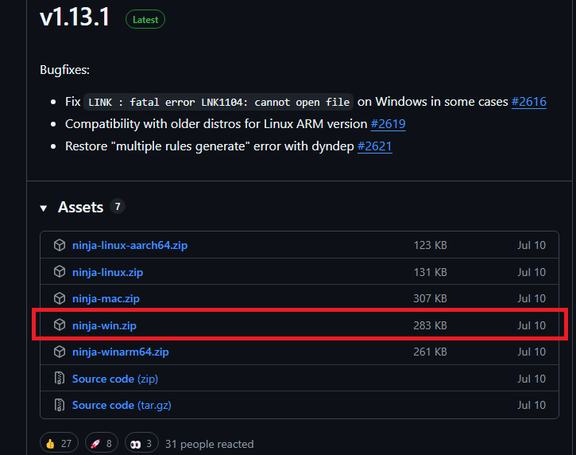

Nos debería quedar algo así
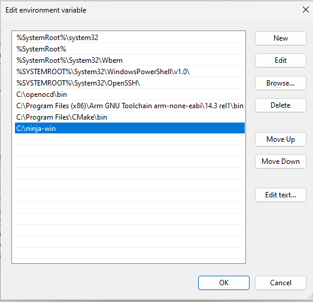
### Instalación STM32CubeMX
Usaremos esta herramienta para generar un proyecto de tipo CMake a partir del archivo .ioc del cual podemos setear los periféricos y demás, generando código con estos periféricos funcionando, funcionará exactamente igual que en el IDE.
**IMPORTANTE**: Si ya se tiene instalado el IDE oficial no es necesario la instalación de esta herramienta, ya que viene como parte del paquete del IDE, por lo que nos servirá igualmente
[STM32CubeMX | Software - STMicroelectronics](https://www.st.com/en/development-tools/stm32cubemx.html) 
Se necesita crear una cuenta o descargar como invitado.

Luego se extrae, y se instala como cualquier programa ejecutando el único archivo que se extrajo. 

### Instalación STLink Utility o STM32CubeProgrammer

Lo más probable es que tengas el firmware del STLink desactualizado, por lo que mediante [STSW-LINK004 | Software - STMicroelectronics](https://www.st.com/en/development-tools/stsw-link004.html) podrás actualizarlo, este paso es importante. Si por algún motivo el STLink Utility no reconoce tu STLink, ir a Flash del programa en MCU -> Lo que probablemente ocurra -> Driver de STLink. 
Si al abrir STLink Utility o STM32CubeProgrammer (que tambien es una opción) te salen los siguientes errores.
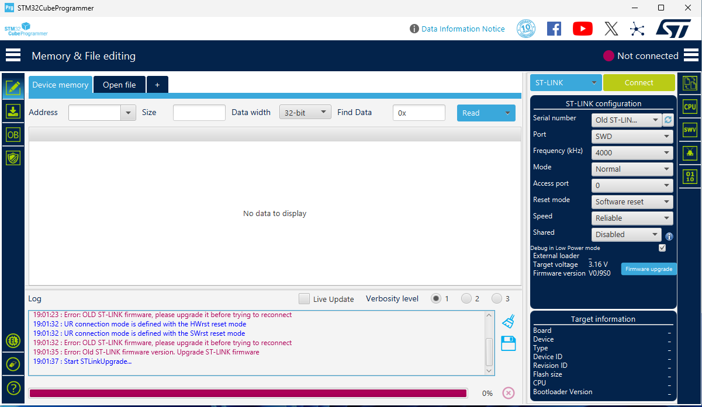
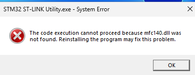 
Y dos faltantes de dlls más, entonces es porque no tenes instalado MSVC, Microsoft Visual C++ Redistributable, si es así, entonces descargar el release x86 y x64 desde 
https://aka.ms/vs/17/release/vc_redist.x86.exe 
https://aka.ms/vs/17/release/vc_redist.x64.exe
Lo más probable es que ya los tengas instalado, pero por las dudas...
Se instalaran los drivers y actualizamos al ultimo firmware.
## Verificación antes de continuar

Abrir PowerShell y escribir los siguientes comandos

Verificamos instalación de OpenOCD con:
	`openocd`
Si devuelve algo que empieza como "*Open On-Chip Debugger 0.12.0 (2025-07-10) ...*" (o la versión que tengas) está correctamente instalado.

Verificamos instalación del *toolchain* de ARM con:
	`arm-none-eabi-gdb --version` 
y nos deberia mostrar informacion sobre la versión del toolchain.

Verificamos la instalación de CMake con:

	cmake --version

Si alguno de los comandos no se reconocen, lo mas probable es que no esten añadidos al Path
	A veces puede pasar que hayamos añadido al Path una variable, mientras teniamos PowerShell abierto, si es así, no reconocerá el comando, se soluciona simplemente cerrando y volviendo a abrir PowerShell.


--- 
Ya tenemos las dos herramientas fundamentales para comenzar con la segunda parte, y es la de configurar nuestro proyecto
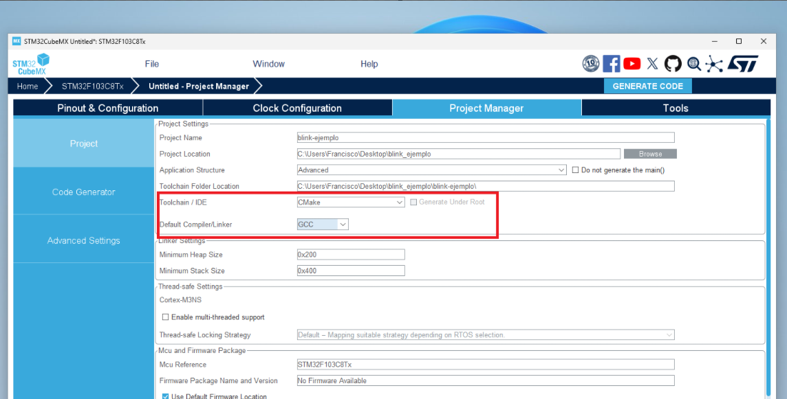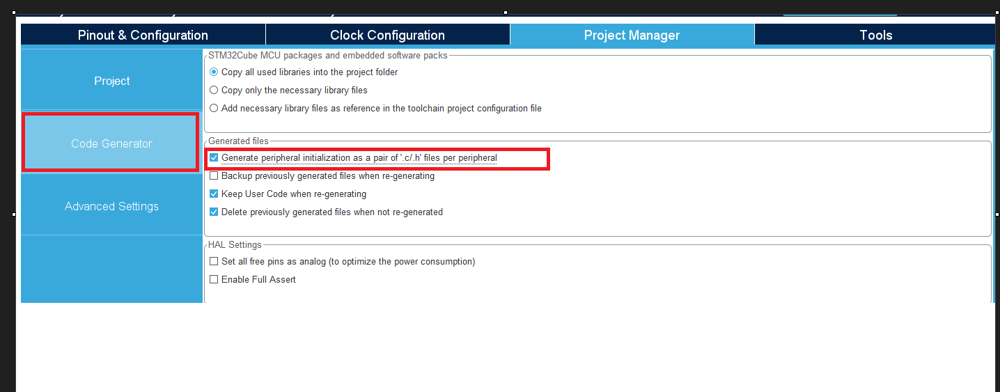

## Compilación con CMake
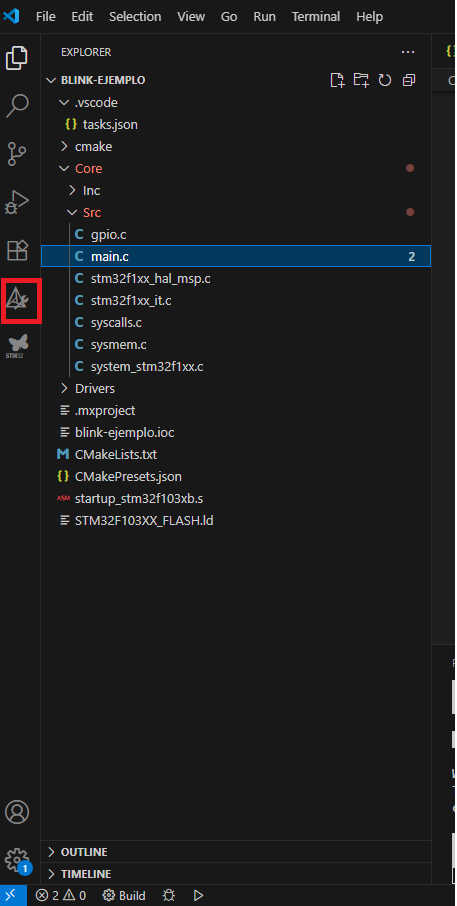
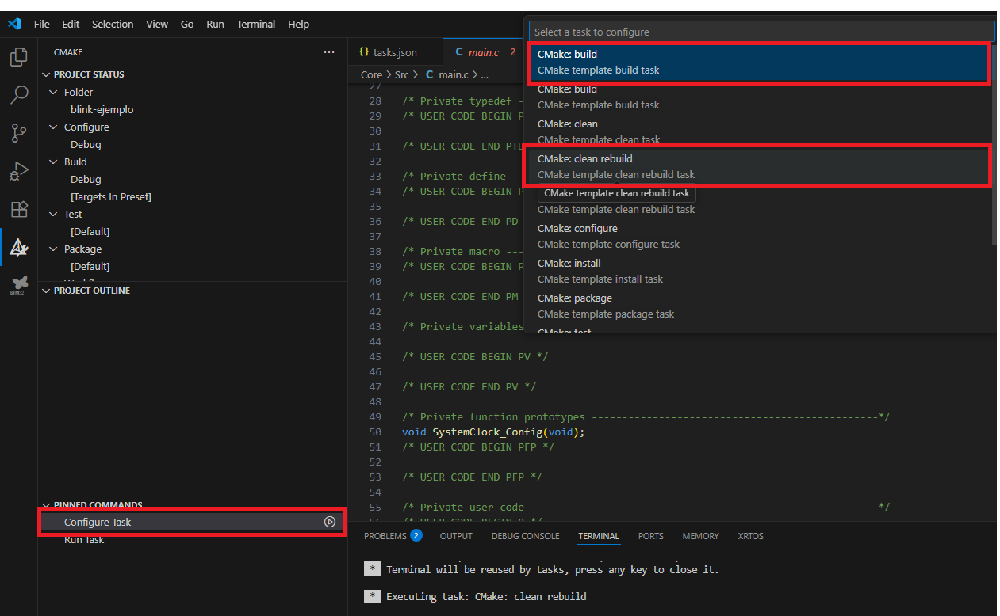

Si aparece un mensaje como este, es porque nos falta instalar alguna dependencia, probablemente "*ninja*". 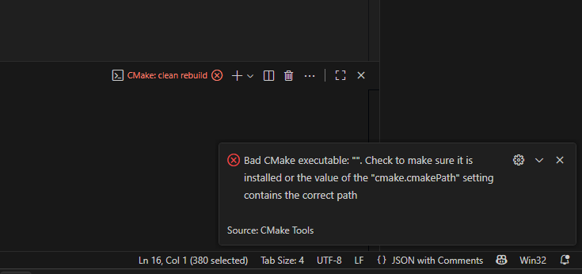 
Luego le damos a "*Delete Cache and Reconfigure*" , si luego de configurar el proyecto, en PROJECT OUTLINE nos aparece algo como lo de la imagen, entonces ya podremos compilar, siempre y cuando hayamos instalado el toolchain de arm-gnu.

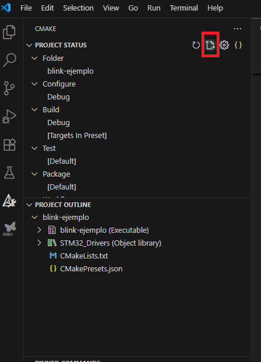

Le damos a Run Task y CMake: Build, deberia compilarnos el proyecto de prueba.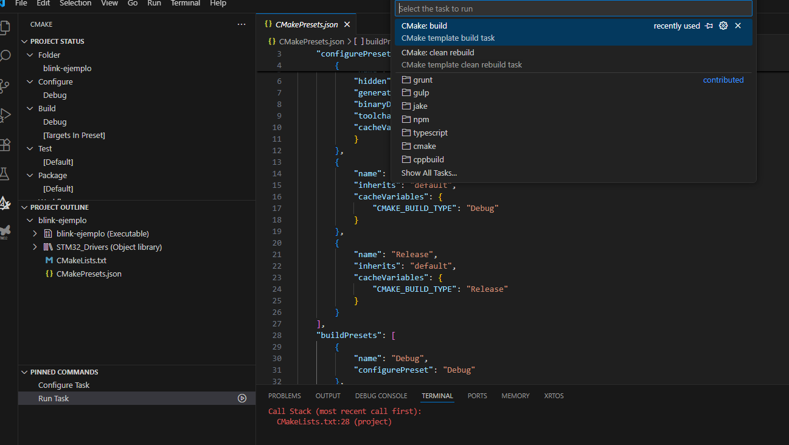


## Flash del programa en MCU con STLINK.
Luego de haber conectado de la siguiente forma nuestro STLINK a la Blue Pill
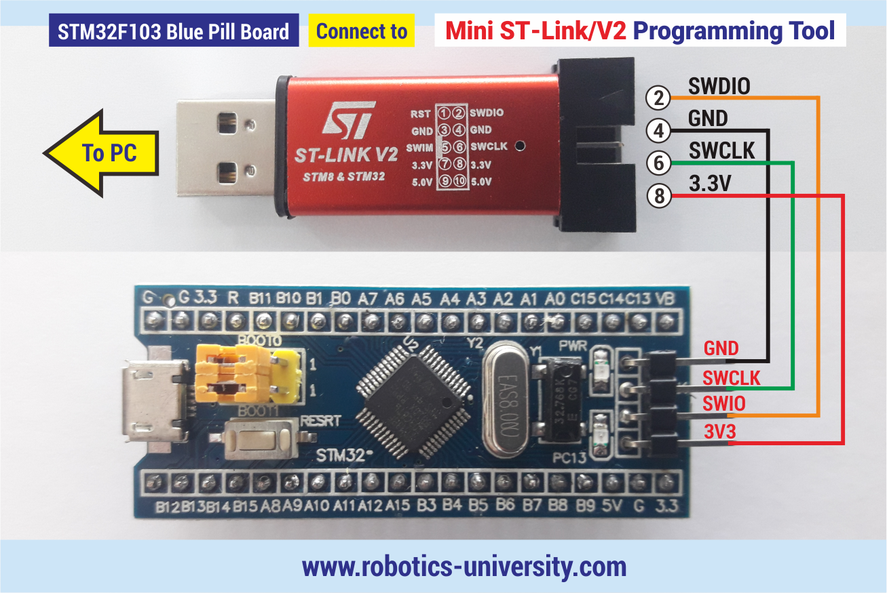
el objetivo próximo es lograr subir un programa, usaremos la herramienta OpenOCD para ello.
Para esto, nos iremos al "*task.json*" y agregaremos la siguiente *task*:

	    "type": "shell",

            "label": "OpenOCD: Flash project (SWD)",

            "command": ""C:\\openocd\\bin\\openocd.exe",

            "args": [

                "-f", "interface/stlink.cfg",

                "-f", "target/stm32f1x.cfg",

                "-c", "program build/Debug/blink-ejemplo.elf verify reset exit"

            ],

            "options": {

                "cwd": "${workspaceFolder}"

            },

            "group": "build",

            "problemMatcher": []

En la línea

	"command": ""C:\\openocd\\bin\\openocd.exe",

Esa ruta debe apuntar al ejecutable de OpenOCD que instalamos previamente.

Es importante cambiar el nombre del ejecutable .elf por el de nuestro proyecto en la linea

	"-c", "program build/Debug/blink-ejemplo.elf verify reset exit"
, se puede modificar esta task para que automáticamente detecte el nombre del proyecto pero eso ya se deja a curiosidad del usuario. En mi caso, el ejecutable se llama "blink-ejemplo.elf"
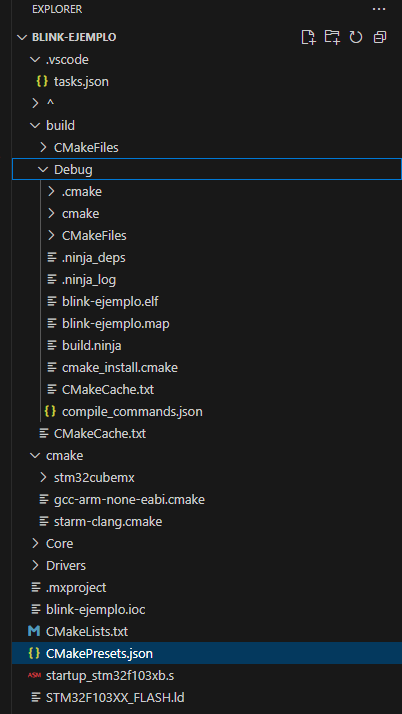

Ahora, como siempre que vayamos a flashear o a buildear nuestro proyecto, nos vamos al icono de la barra izquierda que corresponde a CMake, y nos vamos a Run Task, seleccionamos "OpenOCD: Flash project SWD", este es el nombre de la task que acabamos de crear, puede tener cualquier nombre que nos sea mas comodo de encontrar.

            "label": "OpenOCD: Flash project (SWD)",


### Lo que probablemente ocurra

Lo mas probable, es que cuando tratemos de flashear nuestra Blue Pill, OpenOCD nos reporte el siguiente mensaje

	Open On-Chip Debugger 0.12.0 (2025-07-10) [https://github.com/sysprogs/openocd]
	Licensed under GNU GPL v2
	libusb1 d52e355daa09f17ce64819122cb067b8a2ee0d4b
	For bug reports, read
	        http://openocd.org/doc/doxygen/bugs.html
	Warn : DEPRECATED: auto-selecting transport "swd (dapdirect)". Use 'transport select swd' to suppress this message.
	Error: open failed
	** OpenOCD init failed **
	shutdown command invoked


Podemos aumentar el verbosity (que nos muestre el Debug de lo que va haciendo OpenOCD), agregando el comando "-d3"

	        "-d3",

                "-f", "interface/stlink.cfg",

                "-f", "target/stm32f1x.cfg",

                "-c", "program build/Debug/blink-ejemplo.elf verify reset exit"

#### Driver de STLink

Viendo el LOG que nos devuelve OpenOCD, si viene todo bien, y en un momento encontramos una linea como la siguiente:

	Error: 96 1964 stlink_usb.c:3411 stlink_usb_usb_open(): open failed

Entonces es porque no tenemos instalado el driver de STLink para que se comunique correctamente con Windows. Lo que significa que no se instalaron los drivers con STM32CubeProgrammer .


### Si no se pudo actualizar el firmware
Probablemente salga algo como esto

	Error: The firmware in the ST-Link adapter only supports deprecated HLA.

Cambiamos de stlink.cfg a stlinik-hla.cfg
               
		"-f", "interface/stlink-hla.cfg",

                "-f", "target/stm32f1x.cfg",

                "-c", "program build/Debug/blink-ejemplo.elf verify reset exit


### El MCU clon

La parte mas interesante de la guia, y es que una vez que nos despojemos de los demás errores, probablemente obtengamos algo como esto
	
	Warn : UNEXPECTED idcode: 0x2ba01477
	Error: expected 1 of 1: 0x1ba01477

Lo que implica, que nuestra blue pill tiene un mcu clon, lamentablemente hay muchisimos clones en el mercado y cada uno tiene su serigrafia distinta, hasta algunos tienen la serigrafia original aunque sean clon. Por suerte generalmente hay una manera sencilla de solucionarlo.

Vamos a la carpeta donde tenemos OpenOCD instalado, y luego vamos a la carpeta openocd\share\openocd\scripts\target

buscamos el archivo "stm32f1x.cfg" y hacemos una copia del mismo, la podemos renombrar a "stm32f1x_clon.cfg", le damos click derecho a la copia para editar con VSCode.

En las lineas:

```
#jtag scan chain

if { [info exists CPUTAPID] } {

   set _CPUTAPID $CPUTAPID

} else {

   if { [using_jtag] } {

      # See STM Document RM0008 Section 26.6.3

      set _CPUTAPID 0x3ba00477

   } {

      # this is the SW-DP tap id not the jtag tap id

      set _CPUTAPID 0x1ba01477

   }

}
```

Cambiaremos las dos asignaciones de la variable \_CPUTAPID  a

	 set _CPUTAPID 0x2ba00477

Por ultimo cambiamos en los argumentos de la task el nombre del .cfg que OpenOCD usará:

		"args": [

                "-f", "interface/stlink-hla.cfg",

                "-f", "target/stm32f1x_clon.cfg",

                "-c", "program build/Debug/blink-ejemplo.elf verify reset exit"

	        ],


Si hicimos las cosas bien, luego de *buildear* el programa con CMake, deberiamos poder flashear tranquilamente en nuestra Blue Pill.

## Debug con OpenOCD
Para hacer el debugging con el servicio OpenOCD es bastante sencillo, solo hay que tener algunas consideraciones.
Lo primero que notaremos es que no tenemos generado todavia un "launch.json" por lo tanto lo que haremos es, irnos a la barra lateral izquierda, en *Run and Debug* 
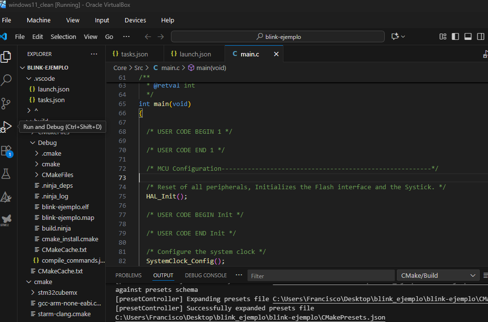
Y luego nos aparecera la opcion de crear un "launch.json" (si no tenemos ningun launch.json se nos desplagara una lista y seleccionaremos "Cortex Debug", luego de eso nos aparecerá lo siguiente, seleccionaremos "Cortex Debug: Debug with OpenOCD"
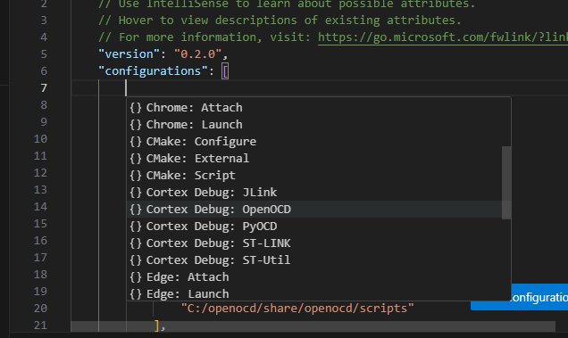
Luego simplemente, cambiamos las rutas del ejecutable y agregamos las "configFiles" necesarias, tiene que quedar algo así:

        {

            "cwd": "${workspaceFolder}",

            "executable": "build/Debug/blink-ejemplo.elf",

            "name": "Debug with OpenOCD",

            "request": "launch",

            "type": "cortex-debug",

            "servertype": "openocd",

            "configFiles": [

                "interface/stlink.cfg",

                "target/stm32f1x_clon.cfg"

            ],

            "searchDir": [

                "C:/openocd/share/openocd/scripts"

            ],

            "runToEntryPoint": "main",

            "liveWatch": {

                "enabled": true,

                "samplesPerSecond": 4

            },

            "showDevDebugOutput": "none",

            "gdbPath": "arm-none-eabi-gdb.exe",

        },

En "searchDir" debe ir la ruta de los scripts donde tenemos la carpeta de OpenOCD (revisar la instalación de OpenOCD).

### Usarlo

Ahora fácilmente podemos agregar variables al "Cortex Live Watch" para poder ver el valor en tiempo real, si el "samplesPerSecond" no llega a ser suficiente se puede aumentar sin problemas.
También se pueden ver los registros y la memoria del microcontrolador. De todas formas el debug con la extensión Cortex-Debug es IGUAL para cualquier micro, por lo tanto hay muchisima información en internet y tutoriales específicos de cómo usarlo.
### IMPORTANTE: Lo que puede pasar ahora

Hay mucha cantidad distinta de clones en el mercado, y algunos tienen un detalle mínimo pero que puede generar dolores de cabeza. 
Puede pasar que el programa funcione bien en la blue pill mientras que no estoy debuggeando, pero al momento de iniciar el debug con OpenOCD presenta comportamiento un poco extraño y a veces marca siempre el mismo breakpoint en `Hal_Init()`, a veces no lo marca pero aun así no parece funcionar bien el programa. 

Lo que en mi caso funcionó fue irnos a la carpeta Core>Src y al archivo `stm32f1xx_hal_msp.c` y comentar la línea `__HAL_AFIO_REMAP_SWJ_DISABLE();` 
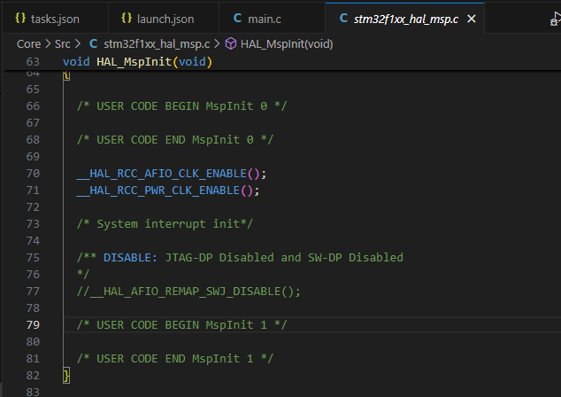


## ¿Cómo queda nuestro flujo de trabajo ahora?

El flujo de trabajo ahora consiste en CONSTRUIR el proyecto con CMake cada vez que hacemos un cambio, luego FLASHEAR el programa en la Blue Pill, y por último DEBUG si es necesario.

Al principio es MUY común olvidarse de construir el proyecto o de flashearlo, es interés del usuario que automatice los flujos de trabajo, por ejemplo, se puede setear la task de FLASH para que si o si antes de flashear se construya el programa (Le puede preguntar a ChatGPT como hacerlo). De ahí en más se pueden agregar atajos de teclado, hay que recordar que a partir del momento que usamos VSCode como "entorno" podemos aprovechar todas las ventajas que tiene y configuraciones.
